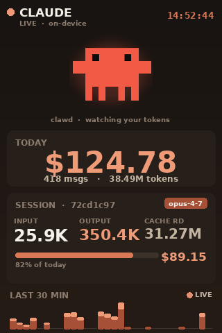

# claude-dashboard

A tiny on-device dashboard for Claude Code token usage, rendered directly to
a Waveshare 3.5" SPI LCD on a Raspberry Pi. Live session counters, today's
spend, a 30-minute sparkline, and **Clawd** — the Claude Code crab mascot —
animated with bob, blink, halo, a jump on every new prompt, and coral
particles that fly out whenever your tokens grow.



## Features

- Reads Claude Code session transcripts from `~/.claude/projects/**/*.jsonl`
- Identifies the active session via `~/.claude/history.jsonl` (same source `/resume` uses)
- Reactive animations driven by real events:
  - **New prompt** → Clawd jumps and emits a burst of particles
  - **Tokens growing** → faster bob, brighter halo, trickle of particles
  - **Idle** → calm bob, occasional blink
- Animated Clawd sprite (official mascot from
  [homarr-labs/dashboard-icons](https://github.com/homarr-labs/dashboard-icons))
- Static/dynamic layer split → ~15 ms per frame on a Pi 4
- Cost estimation per model (Opus / Sonnet / Haiku 4.x pricing)
- Pixel-perfect RGB565 writes to `/dev/fb1`, no X server required
- Systemd user service for autostart

## Hardware

Tested on:

- Raspberry Pi 4 (Raspberry Pi OS Bookworm, 64-bit)
- Waveshare 3.5" LCD (F), ST7796S controller, 320×480 portrait
- HDMI display continues to work independently (the LCD is `fb1`)

## LCD setup

If you haven't wired the Waveshare LCD yet, follow Waveshare's `LCD-show`
instructions to install the device-tree overlay. The relevant `config.txt`
entries on Bookworm are:

```
# Waveshare 3.5" LCD (F) — ST7796S
dtparam=spi=on
dtoverlay=waveshare35c:rotate=180,speed=18000000,fps=30
```

After a reboot you should see `/dev/fb1` and `/sys/class/graphics/fb1/name`
should report `fb_ili9486` (the ST7796S is driven by the ILI9486 driver).

The user running the dashboard needs to be in the `video` group:

```bash
sudo usermod -aG video "$USER"  # log out / back in
```

## Install

```bash
git clone https://github.com/<your-user>/claude-dashboard.git
cd claude-dashboard
python3 -m pip install -r requirements.txt
```

Pillow and numpy are the only runtime dependencies.

## Run

```bash
python3 dashboard.py            # 15 fps default
python3 dashboard.py --fps 10   # easier on the CPU
python3 dashboard.py --png /tmp/preview.png  # render a single frame to PNG
```

CLI flags:

| Flag | Default | Description |
| --- | --- | --- |
| `--fps` | `15` | Target frames per second |
| `--refresh` | `1.0` | Seconds between collector snapshots |
| `--device` | `/dev/fb1` | Framebuffer device path |
| `--png PATH` | – | Render one frame to PNG and exit (useful for previews) |

## Autostart with systemd

```bash
mkdir -p ~/.config/systemd/user
cp claude-dashboard.service ~/.config/systemd/user/
systemctl --user daemon-reload
systemctl --user enable --now claude-dashboard.service
```

`claude-dashboard.service` is included at the repo root. To make the service
start at boot **before** you log in, enable user lingering once:

```bash
sudo loginctl enable-linger "$USER"
```

Useful commands:

```bash
systemctl --user status  claude-dashboard
systemctl --user restart claude-dashboard
journalctl  --user -u    claude-dashboard -f
```

## Project layout

```
collector.py   # parses JSONL transcripts and history.jsonl
render.py      # all drawing — static layer, Clawd, particles, sparkline
theme.py       # colors, fonts, sizes
dashboard.py   # main loop: refresh → step animations → write fb1
clawd.png      # mascot sprite (CC-licensed via dashboard-icons)
```

## Pricing

Per-model token pricing lives in `collector.py::PRICING`. Update the table
if Anthropic changes their rates. The "cost" numbers shown on the
dashboard are best-effort estimates derived from `message.usage` fields in
each session JSONL.

## Credits

- **Clawd sprite** —
  [homarr-labs/dashboard-icons](https://github.com/homarr-labs/dashboard-icons)
- **Claude Code** — [Anthropic](https://anthropic.com)
- **Waveshare 3.5" LCD** — driver and overlay by Waveshare

## License

MIT — see [LICENSE](LICENSE).
